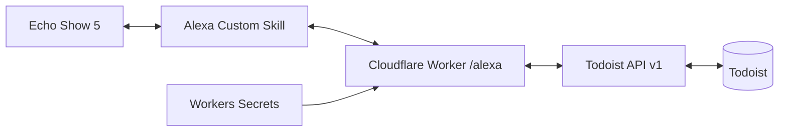

# 実装の判断

## 構成

Todoistが唯一のタスク永続保存先です。番号対応と確認待ちはAlexa sessionAttributesへ返します。
タスク名・期限・更新情報も最大100件・一覧状態60KBまでの短期スナップショットとしてセッション属性に含みます。
Alexa標準リストの複製、完全同期、Webhook、Cronはありません。

## 安全な更新

1. 署名・証明書・タイムスタンプ・Skill ID・userIdを検証。
2. 表示した番号からIDへ解決。最新一覧の同じ番号には置き換えない。
3. Todoistの最新状態を取得して確認。
4. Yesで再取得し、確認時の状態と比較。親の完了は子タスクも再確認して拒否。
5. 同じ操作に同じUUIDを使い、Todoist `/sync` に1コマンドだけ送信。
6. HTTP成功と対象UUIDの`sync_status=ok`を確認。

更新結果不明ならセッション内の凍結済みコマンドを保持し、Yesで同じコマンドを再送できます。
セッション終了・確認期限超過後の新しい発話は別操作です。TodoistのUUID重複防止の保存期間を無期限と仮定せず、アプリ側の再試行も短いセッション内に限定します。
別クライアントと同時に編集する場合、再取得と書き込みの間の競合は完全には排除できません。

## 署名

RSA/SHA-256と受信した生の本文を使用します。SHA-1へのフォールバックはありません。
証明書URLのホスト・プロトコル・ポート・パスを制限し、リダイレクト・資格情報・クエリーを拒否。
証明書のSAN、有効期間、CAチェーンをnode-forgeで検証します。Workersでは`node:tls.rootCertificates`が空になることをローカルworkerdテストで確認したため、公式Node.js LTSのMozilla CAストアから生成した公開ルートCAを`src/trusted-roots.json`へ同梱しています。発行者名のハッシュで候補を選び、対象ルートだけを解析してチェーン署名を検証します。ハッシュ一致だけで信頼しません。入力されたチェーン内の自己署名証明書を信頼ストアに追加しません。
node-forgeで読めないECDSAルートは採用せず、対応できないチェーンは拒否します。これは将来のAmazon証明書更新時に可用性上の制約になり得ます。
証明書失効のOCSP/CRL照会は実装していません（公式Node SDKの同検証処理にもこの制約があります）。

## 無料枠の採用条件

Cloudflare Freeは1日10万リクエスト・1リクエストCPU 10msです。1日50操作・確認込み150リクエスト程度なら件数は十分小さいです。
ただし初回のCAストア解析・チェーン検証はCPUを使います。ローカルworkerdテスト成功はFreeのCPU 10ms適合を意味しません。

実デプロイ後、証明書キャッシュが空のリクエストを含めCPU時間とError 1102を確認するまでは、無料枠運用の受入完了にしません。
CPU超過なら暗号検証の省略ではなく、ネイティブ検証を使うライブラリへの変更、Workers Paid（月額最低5米ドル）、Lambdaへの移植を選びます。有料化は利用者の判断後に行います。

## 状態保存の拡張

同一セッションのみならDB不要です。セッションをまたぐ番号・画面操作が必要になった時点でSQLite版Durable Objectsを検討します。
KVは結果整合性と同一キー書き込み制限があり、直後に読む可変状態やロックの第一候補にはしません。
D1は個人MVPでは検索・スキーマ管理の利点がありません。

## 将来のOAuth・AI

TodoistClientは渡されたトークンを使うため、認証層で利用者別トークンを解決する形へ移行できます。
OAuthはAlexaとTodoistのトークン交換・更新仕様の互換性を別途検証します。必要になった時点で仲介サービスと暗号化トークン保存を追加します。
AIによる抽出を追加する場合も、更新直前の確認・許可制限・Todoistクライアントは再利用します。

## 公式資料（2026-09-12確認）

- [ASK HTTPS・署名検証](https://developer.amazon.com/en-US/docs/alexa/custom-skills/host-a-custom-skill-as-a-web-service.html)
- [公式Node SDK検証処理](https://github.com/alexa/alexa-skills-kit-sdk-for-nodejs/tree/2.0.x/ask-sdk-express-adapter/lib/verifier)
- [Todoist API v1](https://developer.todoist.com/api/v1/)
- [Workers crypto](https://developers.cloudflare.com/workers/runtime-apis/nodejs/crypto/)
- [Workers制限](https://developers.cloudflare.com/workers/platform/limits/)
- [APL Interface](https://developer.amazon.com/en-US/docs/alexa/alexa-presentation-language/apl-interface.html)

## ルートCAの更新

`npm run trust:update`を実行し、生成元Nodeバージョンと差分を確認後、全テストを通して再デプロイします。信頼ストアは自動更新されないため、依存関係更新時・Amazon証明書変更時に確認します。更新元は公式Node 24 LTSのMozilla CAストアです。公開CA証明書のみを保存し、秘密鍵は含みません。

## 開発依存関係

CloudflareのVitest統合が対応するVitest 4系を使用します。互換性日付は両方のローカルランタイムが対応する2026-08-15で固定しています。テスト用miniflareの画像処理依存sharpは修正済み0.35.4以上へoverrideしています。スキルの本番コードは画像処理を使いません。
